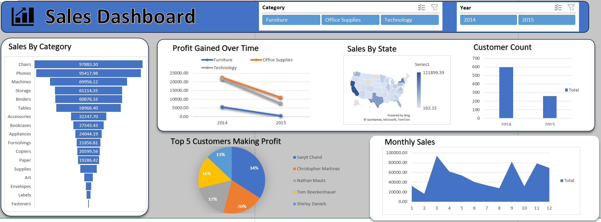

# 📊 Ecommerce Sales Excel Dashboard

## 📌 Project Overview
This project is an interactive ecommerce sales dashboard created entirely using Microsoft Excel.

The workbook includes raw sales data, multiple analysis sheets, and a final dashboard for business reporting.

---

## 📂 Excel Sheet Structure

| Sheet | Description |
|------|------------|
| Dashboard | Final interactive dashboard |
| Sales | Raw dataset |
| SalesByCategory | Category-wise analysis |
| ProfitGained | Profit analysis |
| MonthlySales | Monthly trend |
| Top5Cust | Top customers |
| SalesByState | State-wise sales |

---

## 🛠 Tools Used
- Microsoft Excel
- Pivot Tables
- Pivot Charts
- Excel Formulas
- Slicers

---

## 📊 Dashboard Preview

### Dashboard

### Sheet Structure

---

## 📈 Key Insights
- Highest revenue from Technology category
- Strong monthly sales growth trend
- Top customers generate major revenue
- Certain states show higher profit

---

## 👩‍💻 Author
**Krithi M**  
MBA – Data Science

